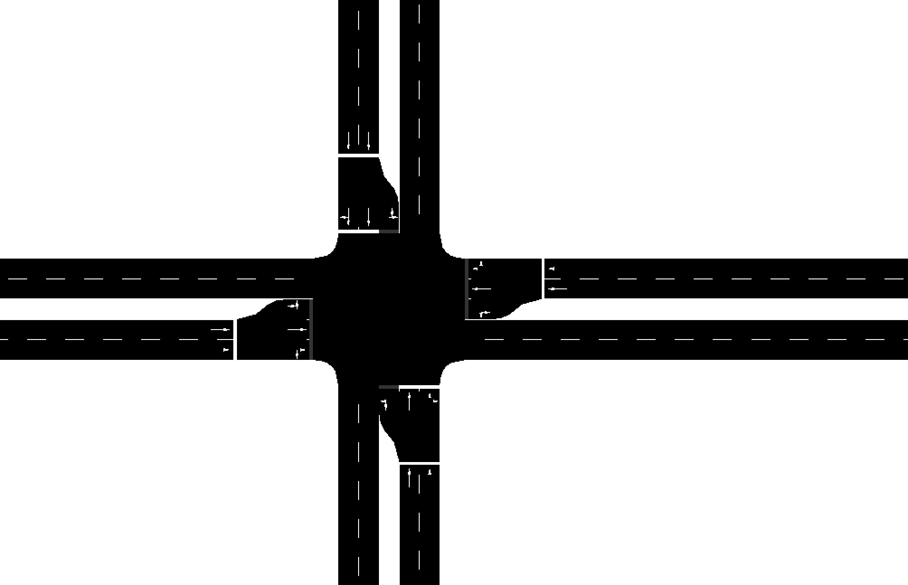
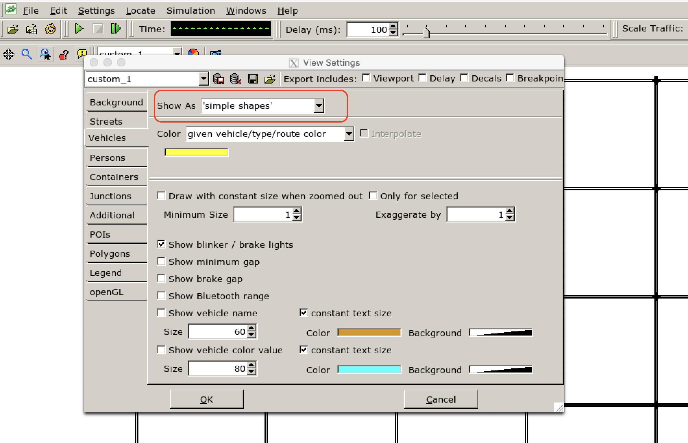
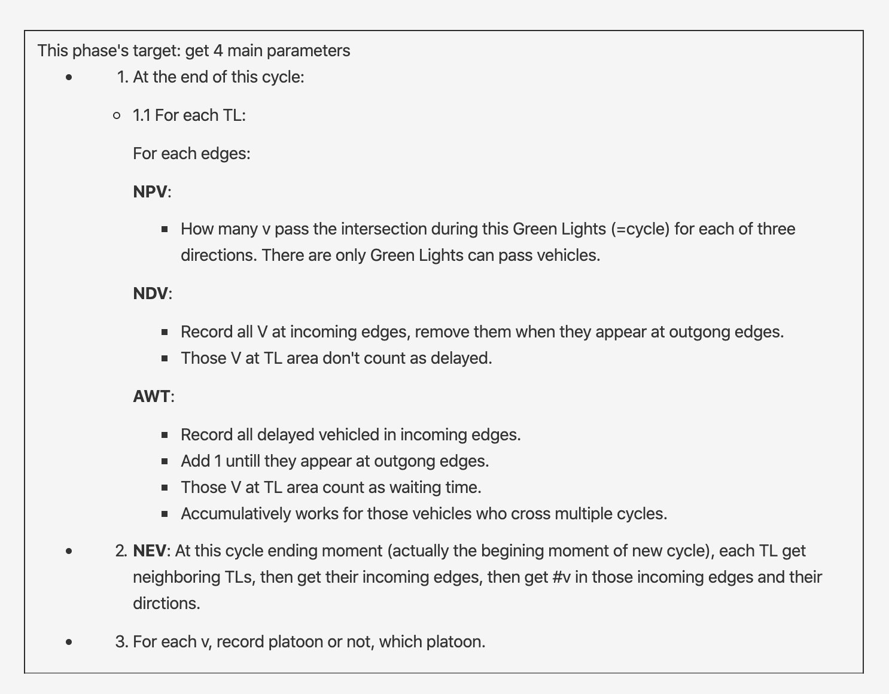

# Grid Net Simulation

A grid net is generagted to run the simulation.

# Contents
- [Grid Net Simulation](#grid-net-simulation)
- [Contents](#contents)
- [<span id="1">Step 1: Generate net file using ***netgenerate***.</span>](#step-1-generate-net-file-using-netgenerate)
    - [**Instruction**:](#instruction)
    - [**Parameters**:](#parameters)
    - [**Result**:](#result)
  - [ATL:](#atl)
  - [ATL: Set show-detectors true in net file tlLogic section**.](#atl-set-show-detectors-true-in-net-file-tllogic-section)
- [<span id="2">Step 2: Generate Traffic Demand (***randomTrips.py***) with multiple vTypes.</span>](#step-2-generate-traffic-demand-randomtripspy-with-multiple-vtypes)
    - [**Parameters**:](#parameters-1)
  - [Multiple vTypes](#multiple-vtypes)
    - [**Multiple vTypes Solution**:](#multiple-vtypes-solution)
      - [**Note**:](#note)
  - [Generate route file by hand using DUArouter for Platoon](#generate-route-file-by-hand-using-duarouter-for-platoon)
  - [Add simpla platoon vType by hand for Platoon](#add-simpla-platoon-vtype-by-hand-for-platoon)
- [<span id="3">Step 3: Change view setting.</span>](#step-3-change-view-setting)
- [<span id="4">Step 4: Run: sumo-gui -c ...</span>](#step-4-run-sumo-gui--c-)
- [<span id="5">Step 5: Use TraCI to run.</span>](#step-5-use-traci-to-run)
  - [Change 2 sumocfg files.](#change-2-sumocfg-files)
  - [Modify "dayuan.grid.PlatoonVTypes.map":](#modify-dayuangridplatoonvtypesmap)
  - [Modify "dayuan.platoon.cfg.xml".](#modify-dayuanplatooncfgxml)
- [<span id="6">Step 6:  Run:</span>](#step-6--run)
  - [Static TL](#static-tl)
  - [Run ATL](#run-atl)
  - [Run PALM/myTL](#run-palmmytl)
- [<span id="9">Extra Note: Some details about implementing my algorithm.</span>](#extra-note-some-details-about-implementing-my-algorithm)
  - [<span id="91">**1: Get all TLs.**</span>](#1-get-all-tls)
  - [<span id="92">**2: Get TL's nearby edges.**</span>](#2-get-tls-nearby-edges)
  - [<span id="93">**3: Record Throughput of each TL.**</span>](#3-record-throughput-of-each-tl)
  - [Logic of getting 4 main parameters:](#logic-of-getting-4-main-parameters)
  - [<span id="94"> **4: Record Throughput of each TL each flow: NPV_t(F(sou,tgt)) .**</span>](#-4-record-throughput-of-each-tl-each-flow-npv_tfsoutgt-)
  - [<span id="refine3">Data Structure Prepare:</span>](#data-structure-prepare)
  - [<span id="refine1">incomingEdges:</span>](#incomingedges)
  - [Added for outgoingEdges:](#added-for-outgoingedges)
  - [<span id="95"> **5: NDV Number of Delayed Vehicles of each TL each flow: NDV_t(F(sou,tgt)) .**</span>](#-5-ndv-number-of-delayed-vehicles-of-each-tl-each-flow-ndv_tfsoutgt-)
  - [<span id="96"> **6: AWT Average Waiting Time of Delayed Vehicles of each TL each flow: AWT_t(F(sou,tgt)) .**</span>](#-6-awt-average-waiting-time-of-delayed-vehicles-of-each-tl-each-flow-awt_tfsoutgt-)
  - [<span id="96reflection1">**Reflection：AWT**</span>](#reflectionawt)
  - [<span id="97"> **7: NEV Number of Expected Vehicles in next cycle of each TL each flow: NEV_t(F(sou,tgt)) .**</span>](#-7-nev-number-of-expected-vehicles-in-next-cycle-of-each-tl-each-flow-nev_tfsoutgt-)
  - [**Tricky of getting neighbor TLs**:](#tricky-of-getting-neighbor-tls)
  - [**How to get Vehicle's turnning left/right/stright:**](#how-to-get-vehicles-turnning-leftrightstright)
  - [**7: NEV Number of Expected Vehicles in next cycle of each TL each flow: NEV_t(F(sou,tgt))**](#7-nev-number-of-expected-vehicles-in-next-cycle-of-each-tl-each-flow-nev_tfsoutgt)
    - [**Add "prepare NEV flowSouTgt_ofAllTLs data structure" before program begins**](#add-prepare-nev-flowsoutgt_ofalltls-data-structure-before-program-begins)
      - [**flowSouTgt_ofAllTLs**](#flowsoutgt_ofalltls)
  - [<span id="98"> **8: Four ratios.**</span>](#-8-four-ratios)
  - [<span id="99"> **9: Schedule for next cycle.**</span>](#-9-schedule-for-next-cycle)
    - [**When?**](#when)
  - [<span id="10">10. Collect data.</span>](#10-collect-data)
  - [<span id="11"> 11. Improvement.</span>](#-11-improvement)
  - [Do traffic schedule/adjustment for each half cycle.](#do-traffic-scheduleadjustment-for-each-half-cycle)

------

# <span id="1">Step 1: Generate net file using ***netgenerate***.</span>

### **Instruction**:

```netfiles$ netgenerate --grid --grid.x-number=6 --grid.y-number=5 --grid.x-length=600 --grid.y-length=500 --output-file=dayuan.grid.net.xml --turn-lanes 1 -L 2 --grid.attach-length 20 --tls.guess true```

```Success.```

### **Parameters**:
1. The number of junctions are --grid.x-number / --grid.y-number
2. The distance between the junctions are --grid.x-length and --grid.y-length. Distance between C0 and C1 are 500m, between C0 and D0 is 600m.
3. If you want to build networks which have the same values for both axes, use --grid.number and --grid.length. 
4. The lengths are given in meters. 
5. Processing Options:
  
      --turn-lanes INT                     Generate INT left-turn lanes

6. Building Defaults Options:

      -L, --default.lanenumber INT         The default number of lanes in an edge

7.   --grid.attach-length FLOAT:           The length of streets attached at the boundary of the grid such that all crossings have four streets (It is not yet possible to have different attach lengths for x and y directions)
8. --tls.guess <BOOL>	Turns on TLS guessing; default: false. Generate those logic in net.xml.

### **Result**:




## ATL:

ATL: We use the **same net file (ensured)** so to compare with static TL. 

Command:
```dyt_grid/netfiles/ATL$ netconvert -s ../dayuan.grid.1.net.xml --plain-output-prefix plain_ATL```

```Success.```

It generated 4 output files: *"plain_ATL.con.xml", "plain_ATL.edg.xml", "plain_ATL.nod.xml", "plain_ATL.tll.xml"*.

Then command:

```dyt_grid/netfiles/ATL$ netconvert -e plain_ATL.edg.xml -n plain_ATL.nod.xml -x plain_ATL.con.xml -o dayuan.grid.3.updatedGenerated.ATL.net.xml --ignore-errors.edge-type --tls.default-type actuated```

```Success.```

It generated 1 file *"dayuan.grid.3.updatedGenerated.ATL.net.xml"*. 

## ATL: Set show-detectors true in net file tlLogic section**.

Copy file *"dayuan.grid.3.**updatedGenerated**.ATL.net.xml"* and change it then save as *"dayuan.grid.3.**updatedByHand**.ATL.net.xml"*. Go to \<tlLogic> section. It looks like this:
```
    <tlLogic id="A0" type="actuated" programID="0" offset="0">
        <phase duration="33" state="GGGggrrrrrGGGggrrrrr" minDur="5" maxDur="50"/>
        <phase duration="3"  ...
    </tlLogic>
    <tlLogic id="A1" type="actuated" programID="0" offset="0">
        <phase duration="33" state="GGGggrrrrrGGGggrrrrr" minDur="5" maxDur="50"/>
        <phase duration="3"  ...
```

Then add following parameters to \<tlLogic> section and change it as follows: 
```
<tlLogic id="A0" type="actuated" programID="0" offset="0">
    <param key="show-detectors" value="true"/>
    <param key="file" value="../../output/dayuan.grid.ATL.detectorA0.log.xml"/>
    <param key="freq" value="300"/>
    <phase duration="33" state="GGGggrrrrrGGGggrrrrr" minDur="5" maxDur="50"/>
    <phase duration="3"  ...
</tlLogic>
```

I checked the "dayuan.grid.3.updatedByHand.ATL.net.xml" and "dayuan.grid.1.net.xml", they only have \<tlLogic> section diff. 

----

# <span id="2">Step 2: Generate Traffic Demand (***randomTrips.py***) with multiple vTypes.</span>

**Traffic Demand** is the word we use to descripte how many vehicles we will have, types of vehicles, the route of each vehicles.

A **trip** is a vehicle movement from one place to another defined by the starting edge (street), the destination edge, and the departure time.

A **route** is an expanded trip, that means, that a route definition contains not only the first and the last edge, but all edges the vehicle will pass.

I definited the [vehicle types](https://sumo.dlr.de/docs/Definition_of_Vehicles,_Vehicle_Types,_and_Routes.html#vehicle_type_distributions) and their distribution in ***"dayuan.grid.me.add.HV.AH.vTypeDist.xml"***.  


### **Parameters**:

1. ../../../../tools/randomTrips.py: Find the correct path of randomTrips.py file.
2. -n dayuan.grid.1.net.xml: As input file. Usually it's a network file.
3. -o dayuan.grid.2.trips.xml: As output file. randomTrips.py generates a trip file. Not route file by default.
4. -r / --route-file dayuan.grid.2.rou.xml: Add "--route-file" attribute it will call DUAROUTER automatically backend and generate route file for us.
5. --fringe-factor 100: The option --fringe-factor increases the probability that trips will start/end at the fringe of the network. If the value 10 is given, edges that have no successor or no predecessor will be 10 times more likely to be chosen as start- or endpoint of a trip. This is useful when modelling through-traffic which starts and ends at the outside of the simulated area.
6. -p 1: The arrival rate is controlled by option --period/-p (default 1). By default this generates vehicles with a constant period and arrival rate of (1/period) per second. By using values below 1, multiple arrivals per second can be achieved.
7.  --prefix option to ensure all vehicles have distinct ids.
8. Car length 4.5m & Bus length 14.63m. Ref:
   
    https://mechanicbase.com/cars/average-car-length/  
    https://ops.fhwa.dot.gov/freight/publications/size_regs_final_rpt/index.htm#bus


## Multiple vTypes

### **Multiple vTypes Solution**:

Put the types into a vTypeDistribution and put the distribution id into the type attribute.

 ***"dayuan.grid.me.add.HV.AH.vTypeDist.xml"***.

Add more vTypes. Now I have 7 vTypes:
- myvTypeCar_platoon, 
- myvTypeBus_platoon, 
- myvTypeTaxi_platoon, 
- myvTypeCar_human_nojoinP, 
- myvTypeBus_human_nojoinP, 
- myvTypeTaxi_human_nojoinP, 
- myvTypeEmergency_human_nojoinP.  

**Generate route files with vType distribution**. 


```dyt_grid/netfiles$ ../../../tools/randomTrips.py -n dayuan.grid.1.net.xml -o dayuan.grid.2.vTypeDist.simpla.trips.xml --period 0.1 --additional-file dayuan.grid.me.add.HV.AV.vTypeDist.xml --fringe-factor 100 --trip-attributes="type=\"typedist1\""```

It has only one output:
***"dayuan.grid.2.vTypeDist.simpla.trips.xml"***.


Then it will generate vType distribution in route files. 
Like *"dayuan.grid.xxx.rou.alt.xml"*:


```
<routes xmlns:xsi="http://www.w3.org/2001/XMLSchema-instance" xsi:noNamespaceSchemaLocation="http://sumo.dlr.de/xsd/routes_file.xsd">
    <vType id="myvTypeBus" length="14.63" maxSpeed="30.00" probability="0.90" vClass="bus" guiShape="bus"/>
    <vehicle id="0" type="myvTypeBus" depart="0.00">
        <routeDistribution last="0">
            <route cost="136.49" probability="1.00000000" edges="bottom4E0 E0D0 E0D0.580.00 D0C0 D0C0.580.00 C0B0 C0B0.580.00 B0bottom1"/>
        </routeDistribution>
    </vehicle>
    <vehicle id="1" type="myvTypeBus" depart="0.20">
        <routeDistribution last="0">
            <route cost="191.72" probability="1.00000000" edges="bottom3D0 D0D1 D0D1.480.00 D1D2 D1D2.480.00 D2D3 D2D3.480.00 D3D4 D3D4.480.00 D4E4 D4E4.580.00 E4top4"/>
        </routeDistribution>
    </vehicle>
    <vType id="myvTypeCar" length="4.50" maxSpeed="35.00" probability="0.10" vClass="passenger" guiShape="passenger"/>
    <vehicle id="2" type="myvTypeCar" depart="0.40">
        <routeDistribution last="0">
            <route cost="283.46" probability="1.00000000" edges="right1F1 F1E1 F1E1.580.00 E1D1 E1D1.580.00 D1C1 D1C1.580.00 C1B1 C1B1.580.00 B1B2 B1B2.480.00 B2B3 B2B3.480.00 B3B4 B3B4.480.00 B4top1"/>
        </routeDistribution>
    </vehicle>
```

#### **Note**:
Then in .sumocfg we **can not** add "dayuan.grid.me.add.vtype.xml" anymore since randomTrips.py already write the vType into route file. 

## Generate route file by hand using DUArouter for Platoon

```netfiles$ duarouter -n dayuan.grid.1.net.xml -r dayuan.grid.2.vTypeDist.simpla.trips.xml -o "platoon/dayuan.grid.4.simpla.duarouter.rou.xml" --ignore-errors --begin 0 --end 3600 --no-step-log --no-warnings --additional-files dayuan.grid.me.add.HV.AH.vTypeDist.xml --vtype-output="platoon/dayuan.grid.4.simpla.duarouter.vType.xml"```

```Success.```

It generated 3 files. 
***"dyt_grid/netfiles/route_with_platoon/dayuan.grid.4.simpla.duarouter.rou.xml"*** (used by all algorithms),
***"dyt_grid/netfiles/route_with_platoon/dayuan.grid.4.simpla.duarouter.rou.alt.xml",
"dyt_grid/netfiles/route_with_platoon/dayuan.grid.4.simpla.duarouter.vType.xml"***.


## Add simpla platoon vType by hand for Platoon

Copy ***"route_with_platoon/dayuan.grid.4.simpla.duarouter.vType.xml"*** and save as ***"route_with_platoon/dayuan.grid.4.simpla.duarouterModifiedByHand.vType.xml"***. Add 3*4 vType for platoon. Don't need to worry about vType distribution which has been guaranteed in trip files.


----
# <span id="3">Step 3: Change view setting.</span>

I edited some view setting. And export the setting as ***"dayuan.view.settings.xml"***.



----
# <span id="4">Step 4: Run: sumo-gui -c ...</span>

```dyt_grid$ sumo-gui -c dayuan.grid.sumocfg```

```Loading configuration... done.```

This is just to have a loot. I don't use this to run my program and collect data.

----
# <span id="5">Step 5: Use TraCI to run.</span> 


## Change 2 sumocfg files.

Then change 2 sumocfg's route files which have only \<net-file ...> are diff. 

Change \<route file> and \<addition file>:
```
<route-files value="netfiles/platoon/dayuan.grid.4.simpla.duarouter.rou.alt.xml"/>
<additional-files value="netfiles/platoon/dayuan.grid.4.simpla.duarouterModifiedByHand.vType.xml"/>
```

All 3 algorithms use 2 sumocfg files, which have only \<net-file ...> are diff. 


## Modify "dayuan.grid.PlatoonVTypes.map":


## Modify "dayuan.platoon.cfg.xml".


Please check the python file [dayuan.grid.xxx.runMe.py]


I implemented a 3 traffic lights algorithms for this simulation. 

- static traffic lights
  - dayuan.grid.staticTL.vTypeDist.simpla.runMe.py
- ATL
  - dayuan.grid.ATL.vTypeDist.simpla.runMe.py
- PALM
  - dayuan.grid.myTL.vTypeDist.simpla.runMe.py


# <span id="6">Step 6:  Run:</span>
   

## Static TL


```dyt_grid$ python3 dayuan.grid.staticTL.vTypeDist.simpla.runMe.py > output/runlog.staticTL.subscribe.vTypeDist.simpla.currentDateAndTime.md```

## Run ATL
```dyt_grid$ python3 dayuan.grid.ATL.vTypeDist.simpla.runMe.py > output/runlog.ATL.subscribe.vTypeDist.simpla.currentDateAndTime.md```


## Run PALM/myTL
```dyt_grid$ python3 dayuan.grid.myTL.vTypeDist.simpla.runMe.py > output/runlog.myTL.subscribe.vTypeDist.simpla.currentDateAndTime.md```


# <span id="9">Extra Note: Some details about implementing my algorithm.</span>

Because my algorithm PALM is actually complicated. The code for it is long. I shared this note to help to explain my code of PALM.

##  <span id="91">**1: Get all TLs.**</span>

```python        
allTLid = traci.trafficlight.getIDList() #all traffic lights id
```

## <span id="92">**2: Get TL's nearby edges.**</span>

``` python
node_i= net_xml.getNode(allTLid[i_TLids])
outgoingEdges = node_i.getOutgoing() 
incomingEdges = node_i.getIncoming()  
```

Coresponding output looks like this: `outgoingEdges: [<edge id="C2B2" from="C2" to="C2B2.580.00"/>, <edge id="C2C1" from="C2" to="C2C1.480.00"/>, <edge id="C2C3" from="C2" to="C2C3.480.00"/>, <edge id="C2D2" from="C2" to="C2D2.580.00"/>]`

- **incomingEdgesOfEachTL**, **outgoingEdgesOfEachTL**
  Saves all incoming edges or outgoing edges of each TL. This 2 variables are added in Step 9.2. (Implemented in [Step 9.7 NEV](#97).)

<br>

## <span id="93">**3: Record Throughput of each TL.**</span>

Count how many total vehiles there are on each edge. Get their ids. Maintain a list of vehicles in incoming edges and outgoing edges. 

***Logic***: If a vehicle is in all previous incoming edges and in current outgoing edges then it means it just passed the intersection. Thoughtput add 1 for this intersection.

- **Bug 1**: It takes few steps to pass the intersection. It means the vehicle who disappears from incoming edge doesn't appear in outgoing edge in next step.

    **Solved**: Record vehilces in all previous incoming edges. V In
    ***allVehiclesAtIncomingEdges_previousAllSteps[allTLid[i_TLids]]***.

- **Bug 2**: If a vehicle begins at outgoing edge, will it be counted?

    **Solved**: excluded. V Not in ***allVehiclesAtOutgoingEdges_previous1Step[allTLid[i_TLids]]***

- **Bug 3**: If a vehicle pass a same intersection twice then it will be counted only once. 

    **Solved**: Remove it after "Thoughput add 1". 


## Logic of getting 4 main parameters:  



[Or check this file](dayuan.grid.Review-%20Logic%20of%20getting%204%20main%20parameters.md)

<br>

## <span id="94"> **4: Record Throughput of each TL each flow: NPV_t(F(sou,tgt)) .**</span>

Need to disassemble the 'thoughput' into *the thoughput of each TL each flow*, i.e. NPV_t(F(sou,tgt)) .

Fistly declare, then initial with 0, then assign value to it at where thoughput += 1.

- ## **cycleDivider**

A cycleDivider is set to divide each cycles. It can also be used for further steps.

It's possible that the cycles of each TL begin at diff time. This has also been considered by set cycleDivider as a Dictionary of all TLs.   

It needs to be initialed before use it since the Dictionary data structure (outside the step forward loop).

The 10086 is set as initial default value which is larger enough than any *phasesTotalAmount*.

```python
    # Step 4: cycle divider for each TL 
    # if cycles begin or program just begins
    if (phaseCurrent == 0) & ( (phasePrevious[allTLid[i_TLids]] == phasesTotalAmount - 1) | (phasePrevious[allTLid[i_TLids]] == 10086) ): 
        cycleDivider[allTLid[i_TLids]] = True 
```

- ## **NPV**
To record the NPV of each TL of each flow, three NPV variables have been set up. They are:
- NPV_eachTLeachFlow_current
- NPV_eachTLeachFlow_previous
- NPV_eachTLeachFlow_allCycles

They are all Dictionaries of all TLs including Dictionaries of sourceEdge and then targetEdge.

The data structure is:


***New*** data structure for NPV_eachTLeachFlow_current:


```python
NPV_eachTLeachFlow_current after record C2: 
{'B2': {'B2': 0, 'C1': 0, 'C3': 0, 'D2': 0}, 
'C1': {'B2': 0, 'C1': 0, 'C3': 0, 'D2': 0}, 
'C3': {'B2': 0, 'C1': 0, 'C3': 0, 'D2': 0}, 
'D2': {'B2': 0, 'C1': 0, 'C3': 0, 'D2': 0}}
```


</br>

However *NPV_eachTLeachFlow_allCycles* has one more out layer which is the cycle No.. 


They all need to be initialed before use it since the Dictionary data structure (outside the step forward loop). 

Furtheremore, 
At the beginning of the program, both *NPV_eachTLeachFlow_current*, *NPV_eachTLeachFlow_previous* need to be set as all 0s.

Also at the beginning of each cycle, *NPV_eachTLeachFlow_current* needs to be set as all 0s. 


## <span id="refine3">Data Structure Prepare:</span>


- ## New
```python
sourceEdge = inEdge.getID() # TL C2 's incomingEdges: [<edge id="B2C2" from="B2" to="C2"/>, <edge id="C1C2" from="C1" to="C2"/>, <edge id="C3C2" from="C3" to="C2"/>, <edge id="D2C2" from="D2" to="C2"/>]
```                    
     
```python
# Below 1 are NEW after fix the reduntant connecting turning area issue
targetEdge = outEdge.getID()
```

- ## **vehivleInOutEdges**

It's used to record each vehilce's sourceEdge and targetEdge, before and after the instersection, (vehicle ID: {source edge ID, target edge ID} ). Then it will be used later to help *NPV*.

It needs to be initialed before use it since the Dictionary data structure ~~(outside the step forward loop)~~. Moved it down to where just before using it, inside the step forward loop. Since each TL each step it will has new related vehicles.  


</br>


## <span id="refine1">incomingEdges:</span>


- ### New:

```python
if edge_i == incomingEdgeID: # (Assuming v pass this TL only once)
    index = thisVehicleWholeRoute.index(edge_i)
    if len(thisVehicleWholeRoute) > index +1: # Now it is "+1" after change road net TL area. It was "+2" to avoid out of range bug
        outgoingEdgeID = thisVehicleWholeRoute[ index + 1 ] #Now it is "+1" after change road net TL area. Old: "+1 is the wrong because +1 is the TL, +2 is next outgoing edge."
```       

## Added for outgoingEdges:
  
 Add this part bacuase not only vehicles in incomingEdges needs vehivleInOutEdges (which has done), those vehicles in outgoingEdges also need it since there are errors when later it was used:

 ```python
# Step 4.3: record throughput of each TL each flow: NPV_t(F(sou,tgt))
incomingEdgeID = vehivleInOutEdges[vehicle_i]["source"]
outgoingEdgeID = vehivleInOutEdges[vehicle_i]["target"]
``` 


</br>

- ## **NPV_eachTLeachFlow_current** 
  
Then after we get throughput we record it into our NPV_eachTLeachFlow_current variable. 

Code:

```python
# record throughput (for Step 3)
if len(allVehiclesAtIncomingEdges_previousAllSteps[allTLid[i_TLids]]) > 0: # record throughput   
    for vehicle_i in allVehiclesAtIncomingEdges_previousAllSteps[allTLid[i_TLids]]:
        if comment >2: print("\n vehicle_i who will be counted for TP:", vehicle_i)
        if (vehicle_i not in allVehiclesAtIncomingEdges) & (vehicle_i in  allVehiclesAtOutgoingEdges) & (vehicle_i not in allVehiclesAtOutgoingEdges_previous1Step[allTLid[i_TLids]]):
            throughput[allTLid[i_TLids]] += 1 # Throughput of this TL +1
            countedVehicles.append(vehicle_i)
            # Step 4.3: record throughput of each TL each flow: NPV_t(F(sou,tgt))
            incomingEdgeID = vehivleInOutEdges[vehicle_i]["source"]
            outgoingEdgeID = vehivleInOutEdges[vehicle_i]["target"]
            if comment >3: print("\n incomingEdgeID:", incomingEdgeID, "outgoingEdgeID:", outgoingEdgeID)
            NPV_eachTLeachFlow_current[allTLid[i_TLids]][incomingEdgeID][outgoingEdgeID] += 1
            if comment >3: print("\n NPV_eachTLeachFlow_current[allTLid[i_TLids]][incomingEdgeID][outgoingEdgeID] ", NPV_eachTLeachFlow_current[allTLid[i_TLids]][incomingEdgeID][outgoingEdgeID])
```


</br>

- ## **NPV_eachTLeachFlow_allCycles**, **NPV_eachTLeachFlow_previous**

Lastly, we record it to *NPV_eachTLeachFlow_allCycles* and *NPV_eachTLeachFlow_previous*. 

```python
# Step 4.4: phasePreviousStep[allTLid[i_TLids]] = phaseCurrentStep for next step # update every step
phasePreviousStep[allTLid[i_TLids]] = phaseCurrentStep
if  cycleDivider[allTLid[i_TLids]] == True : # Step 4.4: for next cycle
    NPV_eachTLeachFlow_previousCycle[allTLid[i_TLids]] = NPV_eachTLeachFlow_currentCycle[allTLid[i_TLids]]                
    NPV_eachTLeachFlow_allCycles[allTLid[i_TLids]][ cycleNo[allTLid[i_TLids]] ] = NPV_eachTLeachFlow_currentCycle[allTLid[i_TLids]]
    cycleNo[allTLid[i_TLids]] += 1
    cycleDivider[allTLid[i_TLids]] = False # it's true when first step of new cycle, and set it back to false at the end of this first step of new cycle
                    
```


<br>


## <span id="95"> **5: NDV Number of Delayed Vehicles of each TL each flow: NDV_t(F(sou,tgt)) .**</span>

</br>

***Logic***: 

Record all vehicles in incoming edges of each TL, remove it when it is counted for Thoughtput/NPV (apears in outgoing edges), all those left are NDV. 

So those vehicles in TL areas are not counted.

Then at the end of this cycle, those left vehicles in *NDV_eachTLeachFlow_currentCycle* is the number of delayed vehicles who cannot pass the TL. They might joined the incoming edges in current cycle or even earlier cycles.

- ## **NDV_eachTLeachFlow_currentCycle** 

```python
{'A0': 
    {'A1A0.480.00':    
        {'A0A1': ['123', '222'], # 123, 222 is vehicle No. examples.  
        'A0B0': [], 
        'A0bottom0': [], 
        'A0left0': []}, 
    'B0A0.580.00': 
        {'A0A1': [], 
        'A0B0': [], 
        'A0bottom0': [], 
        'A0left0': []}, 
    'bottom0A0': 
        {'A0A1': [], 
        'A0B0': [], 
        'A0bottom0': [], 
        'A0left0': []}, 
    'left0A0': 
        {'A0A1': [], 
        'A0B0': [], 
        'A0bottom0': [], 
        'A0left0': []}
    }, 
...,
'C2': {'B2C2.580.00': {'C2B2': [], 'C2C1': [], 'C2C3': [], 'C2D2': []}, 'C1C2.480.00': {'C2B2': [], 'C2C1': [], 'C2C3': [], 'C2D2': []}, 'C3C2.480.00': {'C2B2': [], 'C2C1': [], 'C2C3': [], 'C2D2': []}, 'D2C2.580.00': {'C2B2': [], 'C2C1': [], 'C2C3': [], 'C2D2': []}}, ...
}
```

As what *NDV_eachTLeachFlow_currentCycle* do. Fistly declare, then initial with 0, then assign value to it at where thoughput += 1 (where it's diff from NPV). 

Specifically, add all v in incoming edges into *NDV_eachTLeachFlow_currentCycle*  then reomve then one by one when they are counted as thoughput (which means that one passed) 


- ## **NDV_eachTLeachFlow_previousCycle** 
  
Assign the *NDV_eachTLeachFlow_currentCycle* to *NDV_eachTLeachFlow_previousCycle* at the end of the first step of new cycle. 


<br>

## <span id="96"> **6: AWT Average Waiting Time of Delayed Vehicles of each TL each flow: AWT_t(F(sou,tgt)) .**</span>

***Logic***: Add one more layer of *NDV_eachTLeachFlow_currentCycle*'s data structure to record v's waiting time by adding 1 each SUMO step ( 1 step == 1 s). We can make full use of NDV for AWT. 

All vehicles who go into the incoming edges will be recorded as well as their entering times, then update the times (steps) by adding 1 until they join those outgoing edges. 

Remove those vehicles when they join outging edges, then those left are delayed vehicles only. So the time they used in TL areas are also counted as waiting time.

Those vehicles we already got from *NDV_eachTLeachFlow_currentCycle* so we can just copy them. At the end of each cycle, those vehicle in *NDV_eachTLeachFlow_currentCycle* and *AWT_eachTLeachFlow_currentCycle* should be same vehicles (they are delayed vehicles). 

- ## **AWT_eachTLeachFlow_currentCycle**:
```python
{'A0': 
    {'A1A0.480.00':    
        {'A0A1': {'123':0, '222':,0 }, # 0 is the number of SUMO steps=seconds 
        'A0B0': {}, 
        'A0bottom0': {}, 
        'A0left0': {}}, 
    'B0A0.580.00': 
        {'A0A1': {}, 
        'A0B0': {}, 
        'A0bottom0': {}, 
        'A0left0': {}}, 
    'bottom0A0': 
        {'A0A1': {}, 
        'A0B0': {}, 
        'A0bottom0': {}, 
        'A0left0': {}}, 
    'left0A0': 
        {'A0A1': {}, 
        'A0B0': {}, 
        'A0bottom0': {}, 
        'A0left0': {}}
    }, 
'A1": ...,
}
```

</br>

## <span id="96reflection1">**Reflection：AWT**</span>


1. Do we need to copy vehicles in NDV into AWT at each sumo step? or just at the end of the cycle?
    - Yes. At each step. Operation in this way also help us to control steps counting (no need extra logic for it).  


2. AWT: average waiting time of only delayed vehicles or all vehicles?
    - Delayed vehicles who don't leave the incoming edges before the end of current cycle.

3. AWT: if a vehicle joined at cycle_t and didn't pass, wait for cycle_t+1, will it be counted continuously?
    - Yes. Some changes are needed:
    - Don't reset AWT to 0s at the beginning of a cycle. Only do it at the begining of the program. 
    - Remove those vechiles in AWT who has passed after the average waiting time has been used for updating cycle settings, i.e. at the beginning of a new cycle. So a variable who records which vehicles has been removed from NDV is needed to help. Then those vehicles who are not removed will be counted by acculumative steps. 

4. Where 4 main ratio parameters are needed 
    - is at the beginning of a new cycle before any action of the new cycle has been done, i.e. where *cycleDivider* is true.
    - Then update the cycle duration for new cycle.
    - Then transfer the xxx_currentCycle to xxx_previousCycle to keep it for future use.


<br>

## <span id="97"> **7: NEV Number of Expected Vehicles in next cycle of each TL each flow: NEV_t(F(sou,tgt)) .**</span>

*NEV_eachTLeachFlow_currentCycle* is those vehicles which we think will join the incoming edges in next cycle. 

***LOGIC***: At this cycle ending moment (actually before the beginning of next cycle in code), each TL get neighbor TLs and their incoming edges, then get #v in those incoming edges and their dirctions.


Pseudo Code:

```python
Let's call this TL as TL1. Assume it's crossroads. It has four nearby TLs which are TL_E, TL_N, TL_W, TL_S. Edge E1 is the edge between TL1 and TL_E.

# Get neighboring TLs.
1, get TL1’s edges E1, E2, E3, E4, 
2, then get that edge E1's connected TLs, like TL_E.
# Get Vehilces.
3, get TL_E's all incoming edges and all vehicles and their directions in those incoming eges. 
4, repeat for E2, E3, E4.
```


</br>

## **Tricky of getting neighbor TLs**: 

 TL and Edge are node data structure. Connection is the DS connecting them.

 *neighboringNodesEdges_incoming.getConnections()* is the connection between incoming edges and TL.
 
 *neighboringNodesEdges_incoming.getConnections().getFrom()* is the incoming edges: <edge id="B2C2" from="B2" to="B2C2.580.00"/>.
 
 *neighboringNodesEdges_incoming.getConnections().getFrom().getFromNode()* is that edge's another end (another TL).  
 
 *neighboringNodesEdges_incoming.getConnections().getFrom().getFromNode().getID(*) gets the neighbor TL's ID.


</br>

- ## **neighborTLsSetOfEachTL**
  Saves all neighboring TLs of each TL into a set. 

    ```neighborTLsSetOfEachTL: {'A0': {'A1', 'A0', 'B0'},  ..., 'C2': {'C3', 'C1', 'B2', 'D2'}, ...}```

- ## **incomingEdgesOfEachTL**, **outgoingEdgesOfEachTL**
  Saves all incoming edges or outgoing edges of each TL.

## **How to get Vehicle's turnning left/right/stright:**

Cannot use traci.vehicle.getSignals() because it is activated 7 seconds before reaching the intersection. ([Sumo Vehicle Singlas](https://sumo.dlr.de/docs/TraCI/Vehicle_Signalling.html) , [Vehicle_Value_Retrieval](https://sumo.dlr.de/docs/TraCI/Vehicle_Value_Retrieval.html))

**My solution:**

*traci.vehicle.getNextTLS():* 
```
next TLs: (('C1', 11, 1.0010705358147578, 'G'), ('C2', 11, 501.2710705358147, 'G'), ('C3', 11, 1001.5410705358147, 'G'), ('C4', 10, 1501.8110705358147, 'G'), ('D4', 16, 2085.5110705358147, 'r'), ('E4', 16, 2651.911070535815, 'r'), ('F4', 16, 3218.311070535815, 'r')) 

This above example prints a vehicle's all next TLs, its first next TL is current TL's neighbor "C1", next next TL is current Tl "C2", so it will must be one of the NEV!
```
**Logic**: The next intersection of those vehicles at TL1's neighbor TL_E's incoming edges must be TL_E, and if next next intersection is TL1 then it the expected vehicle we want. 


<br>


<br>
<br>

## **7: NEV Number of Expected Vehicles in next cycle of each TL each flow: NEV_t(F(sou,tgt))**

Before, I have found those vehicles which should be counted as NEV. 

```python
# Step 7.3: get TL's neighbor node TLs and their incoming Edges
# Step 7.4: collect all vehicles in the incoming edges of TL's neighbor node TLs
# Step 7.5: determine whether this vehicle is going to current TL. By judging next next TL is current TL or not.
# Step 7.6 confirmed! add into NEV
...
```

Only do this at the beginning of each cycle, except the first one when program begins. Because at the first cycle beginning, i.e. program begins, the data struture is not initialized yet.

The condition used is :

```python
if  (cycleDivider[allTLid[i_TLids]] == True) & (initialOnlyOnce[allTLid[i_TLids]] >= 1): #(traci.simulation.getTime() >= 2) this one also works:  # & (phasePreviousStep[allTLid[i_TLids]] != 10086) this one doesn't work: 
```

### **Add "prepare NEV flowSouTgt_ofAllTLs data structure" before program begins**


#### **flowSouTgt_ofAllTLs**
  ```
  Stores all flows of all TLs. 
    
  Prepare it before the begin of program.

  Use it when each cycle begins except program begins. Used to prepare NEV's data structure and flush it to 0s. 

  ***Note***: It is similiar to "*flowSouTgt*". But the diff is it has all TLs before program. While flowSouTgt only have those previous TLs which the code went through.
  ```


## <span id="98"> **8: Four ratios.**</span>

***Position***:
It has to be here, since next section the *"xxx_currentCycle"* will be overwrote.

***Data Structure***:
Use as *"xxx_currentCycle"* with each TL and each flow. 

The NDV_ratio and AWT_ratio are more similar, using len(). The NPV_ratio and NEV_ratio are more similiar. The all four are similiar.


## <span id="99"> **9: Schedule for next cycle.**</span>

### **When?**

***I need to do it at the very last step of previous cycle, before the begining of new cycle.*** 

To do it I need this variable to help to decide this moment:
- stepCounter_inLastPhase[allTLid[i_TLids]] 

definition of variable "cycleDivider" :


```python
# if cycles begin (change to "last step in the last phase in curr cycle") or program just begins 
if (phaseCurrentStep== phasesTotalAmount - 1) and (phasePreviousStep[allTLid[i_TLids]] == phasesTotalAmount - 2): # the moment from last_but_one phase to last phase
    stepCounter_inLastPhase[allTLid[i_TLids]] = 0
if (phaseCurrentStep == phasesTotalAmount - 1): # is last phase in curr cycle
    stepCounter_inLastPhase[allTLid[i_TLids]] += 1
    if (stepCounter_inLastPhase[allTLid[i_TLids]] == phaseDuration_currPhase): # is last step in the last phase in curr cycle
        cycleDivider[allTLid[i_TLids]] = True 
        if "core" in comments: print("cycleDivider ", allTLid[i_TLids], " is set true. ",  cycleDivider)
elif (phaseCurrentStep == 0) & (phasePreviousStep[allTLid[i_TLids]] == 10086): # program just begins
    cycleDivider[allTLid[i_TLids]] = True 
    phasePreviousStep[allTLid[i_TLids]] =  -1 
    if "core" in comments: print("cycleDivider ", allTLid[i_TLids], " is set true. ",  cycleDivider, " phasePreviousStep[", allTLid[i_TLids], "] is set to -1.")
```


Successed. 


## <span id="10">10. Collect data.</span>


## <span id="11"> 11. Improvement.</span>
    


## Do traffic schedule/adjustment for each half cycle.

So far wo re-schedule between each cycle. But the new scheduled traffic light plan might not be suitable for the second half of new cycle.

For exmaple, when there are 4 phases, "GRGR, YRYR, RGRG, RYRY". My new schedule for next cycle may be good for first 2 phases. But after the 2nd phase, vehicles moves, then the condition of all flows might change much, my plan may be not suitable for the 3rd and 4th phases.

So I do re-schedule each half cycle (after each G light phase.) To make every G light phase has its own new re-scheduled traffic light plan.

- ***halfCycleDivider[allTLid[i_TLids]]***

1. Did simple re-schedule for when remaining capacity is enough
2. Did for when remaining capacity is not enough
3. Change the 4ratio re-schedule from for each cycle aslo to for half cycle
    - Found the NPV NDV AWT are collected for each step. No need change.
    - NEV and 4 ratios are done for each cycle. Changed via only changed the "if".
    - Changed re-scheduling when not enough. Integrated with when enough.

